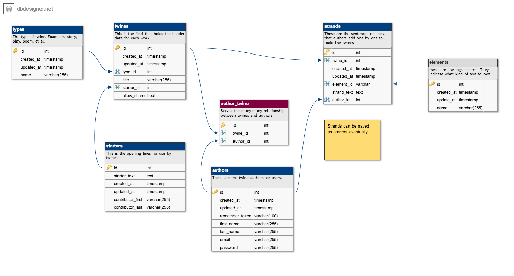

# Project 4 - StoryWriter Project for CSCI-E15 (DWA)

## Live URL
StoryWriter <http://p4.troubleU.com>

## Description
This repository contains the code for an app called _StoryWriter_. StoryWriter is a dynamic web application that allows two or more contributors to collaborate as authors in building a story, poem, song or play, one line at a time.
Each author takes a turn in sequence continuing round and round until “The End.”

#### MVP
Authors can register, and build stories (called _twines_), but selecting from a small database of starter lines (_starters_). They can edit the twines (title, twine type, and last entered line). The lines that are in each twine are provided only by seeders in the MVP. So today, users can see all of their twines, create new twines, update  and delete twines. There is User integration so that users can only see their twines, and guests are limited to information about the site and registration.

#### Next Generation
The product ultimately is about writing a a story with friends and other authors (users). There will be the functionality to add _strands_, which are the individual lines that users will contribute. The strands will have a elements at the beginning of each strand to indicate if the new strand has a break for a paragraph, stanza, chapter, etc. The elements and strands will be "compiled" to view the document in the intended form.

I hope you enjoy the application.

## Demo
<http://www.screencast.com/t/QywByyKStg>

## Details for teaching team
No login required.

## Outside code
There are several contributions from other sources to make StoryWriter work:

#### Log Viewer
* <https://github.com/rap2hpoutre/laravel-log-viewer>
* Simple log reporting GUI.

#### Milligram CSS Framework
* <https://milligram.github.io>
* This framework provides minimalist CSS styling via CDN

#### Susan Buck's Foobooks.css from Foobooks class example
* <https://github.com/susanBuck/foobooks/blob/master/public/css/foobooks.css>
* In the interest of time and focus on the key elements, this project relies on css Milligram CSS Framework (noted above) with layout help from foobooks.css

#### Laravel Version Info

#### License
The Laravel framework is open-sourced software licensed under the [MIT license](http://opensource.org/licenses/MIT).
